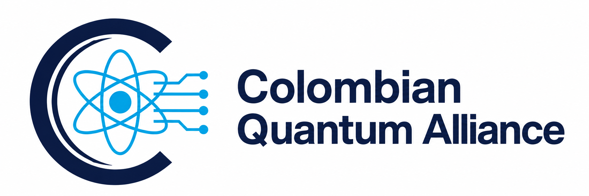

  

# Colombian Quantum Alliance (CQA)

The Colombian Quantum Alliance (CQA) connects researchers, educators, industry professionals, and international collaborators who contribute voluntarily to Quantum Information Science (QIS) in Colombia. Our vision is for Colombia to become an active and connected hub for QIS by 2036, through education, scientific exchange, and collaborative research.

## About this repository

This repository is the shared archive for CQA's knowledge and outputs: documents, reports, research papers, books, presentations, educational resources, and other materials produced through the alliance's activities and collaborations.

It provides a place to preserve our work, track revisions, recognize contributors, and make resources easier to discover and build upon.

## What belongs here

- **Documents:** strategy, roadmaps, working documents, and records of alliance activities.
- **Reports:** project results, technical analyses, evaluations, and activity reports.
- **Papers:** research manuscripts, preprints, publications, and supporting materials.
- **Books:** books, chapters, and longer educational publications developed by CQA contributors.
- **Presentations:** talks, seminars, workshops, and community presentations.
- **Educational resources:** courses, tutorials, notebooks, and learning materials.
- **Other outputs:** resources and supporting files created through CQA projects and collaborations.

## Current PDF collection

The repository currently contains reviewed PDF releases in these folders:

| Folder | Contents |
|---|---|
| [`books/`](books/) | Current CQA and CyberColombia books in their available language editions. |
| [`papers/`](papers/) | Current English research manuscripts. |
| [`reports/`](reports/) | Current English institutional reports. |

Only the latest identified PDF release of each work and language edition is included. Editable sources, superseded revisions, exact duplicates, confidential documents, meeting notes, raw survey or feedback exports, and participant contact lists are excluded from this public repository.

Each PDF retains the copyright and reuse terms printed in that document. Those terms take precedence over the repository-level license for that PDF.

## Books

| Title | Language | Edition |
|---|---|---|
| [Mathematical and Physical Foundations for Quantum Computing](books/Mathematical_and_Physical_Foundations_for_Quantum_Computing_v09_EN.pdf) | English | v09 |
| [Mathematical and Physical Foundations for Quantum Computing](books/Mathematical_and_Physical_Foundations_for_Quantum_Computing_v09_ES.pdf) | Spanish | v09 |
| [Quantum Information Science](books/Quantum_Information_Science_v02_EN.pdf) | English | v02, September 2026 |

### Quantum Information Science

**Prepared by:** Esteban Hernández, PhD — CyberColombia / Quantum Colombia Alliance. **Status:** developed syllabus and study text, English edition v02. **Length:** 181 pages.

The book groups the field into 16 thematic chapters across five parts: operational theory and quantum information; quantum communication; computation and scientific applications; reliable physical systems; and metrology and thermodynamics. Its 112 thematic sections include explanatory development, central results, assumptions, and detailed study scope.

It includes 16 worked examples, 64 exercises, 16 selected analytical solutions, 16 integrated laboratory specifications, six project briefs, and chapter reading lists. Laboratory activities are specifications; executable notebooks are not included in this release.

The prerequisite is [Mathematical and Physical Foundations for Quantum Computing](books/Mathematical_and_Physical_Foundations_for_Quantum_Computing_v09_EN.pdf). Topics already covered there are referenced by section rather than taught again. The QIS volume follows the same visual and pedagogical template.

## Adding materials

Organize new contributions in descriptive folders such as `documents/`, `reports/`, `papers/`, `books/`, `presentations/`, or `education/`, creating them as needed. Use clear filenames that identify the topic and, when useful, the date or version.

For each contribution, include its title, authors or contributors, date, status (such as draft or published), and a short description. Provide the reviewed PDF release for this public collection and retain editable sources separately. Include citation details or a DOI for published work. State any material-specific license or reuse terms alongside the contribution.

## Connect with CQA

For collaboration and contributions, contact [quantum@cybercolombia.org](mailto:quantum@cybercolombia.org).
